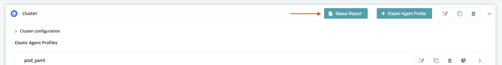
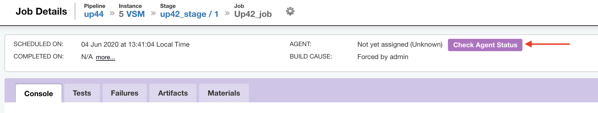

# Kubernetes Elastic Agent plugin for GoCD

## Troubleshooting

### Status Report

The Plugin Status report gives a quick overview of the pods. The status report lists the various virtual pods created. The report also lists the errors and warnings to quickly troubleshoot issues.

<hr/>

##### Accessing the Kubernetes Cluster Status Report
You can access the status report from two places -

1. **Directly from the plugin settings page:**

  

2. **From the job details page:**

  


### Pods getting terminated while running jobs

If you have multiple GoCD servers with cluster profiles pointing to the same Kubernetes cluster, make sure that the namespace is different.

Otherwise, the plugin of one GoCD server will end up terminating pods started by the plugin in the other GoCD servers, since those pods
won't register with it.


### Enable Debug Logs

#### If you are on GoCD version 19.6 and above:

Edit the file `wrapper-properties.conf` on your GoCD server and add the following options. The location of the `wrapper-properties.conf` can be found in the [installation documentation](https://docs.gocd.org/current/installation/installing_go_server.html) of the GoCD server.

```properties
# We recommend that you begin with the index `100` and increment the index for each system property
wrapper.java.additional.100=-Dplugin.cd.go.contrib.elasticagent.kubernetes.log.level=debug
```

If you're running with GoCD server 19.6 and above on docker using one of the supported GoCD server images, set the environment variable `GOCD_SERVER_JVM_OPTIONS`:

```shell
docker run -e "GOCD_SERVER_JVM_OPTIONS=-Dplugin.cd.go.contrib.elasticagent.kubernetes.log.level=debug" ...
```

#### If you are on GoCD version 19.5 and lower:

* On Linux:

    Enabling debug level logging can help you troubleshoot an issue with this plugin. To enable debug level logs, edit the file `/etc/default/go-server` (for Linux) to add:

    ```shell
    export GO_SERVER_SYSTEM_PROPERTIES="$GO_SERVER_SYSTEM_PROPERTIES -Dplugin.cd.go.contrib.elasticagent.kubernetes.log.level=debug"
    ```

    If you're running the server via `./server.sh` script:

    ```shell
    $ GO_SERVER_SYSTEM_PROPERTIES="-Dplugin.cd.go.contrib.elasticagent.kubernetes.log.level=debug" ./server.sh
    ```

* On windows:

    Edit the file `config/wrapper-properties.conf` inside the GoCD Server installation directory (typically `C:\Program Files\Go Server`):

    ```
    # config/wrapper-properties.conf
    # since the last "wrapper.java.additional" index is 15, we use the next available index.
    wrapper.java.additional.16=-Dplugin.cd.go.contrib.elasticagent.kubernetes.log.level=debug
    ```
